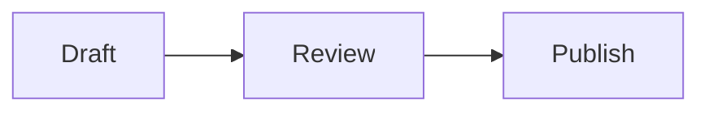

# Code blocks and Mermaid diagrams

The Markdown preview recognizes a fixed set of fenced code block labels. It highlights
TypeScript, JavaScript, JSON, HTML, CSS, Markdown, Bash, Python, and SQL with Shiki. Common
short labels such as `ts`, `js`, `md`, `sh`, and `py` work too.

Unknown and unlabelled fences remain plain code blocks. They do not fail the preview or cause
the browser to download another language definition.

A fence labelled `mermaid` renders as a Mermaid diagram:

````markdown

````

The preview loads Mermaid only when it encounters a Mermaid fence. A malformed diagram keeps
its source visible and shows an error next to that block. The rest of the document continues
to render.

Documents are untrusted. Mermaid runs with strict security, HTML labels and click callbacks
disabled, and bounded text and edge counts. Configuration directives and Mermaid frontmatter
are rejected, so a document cannot replace the application settings. Raw HTML in Markdown
also remains disabled.

Highlighting and diagram rendering affect only the preview. Saving, collaboration, reopening,
and Markdown export retain the original fenced source.
